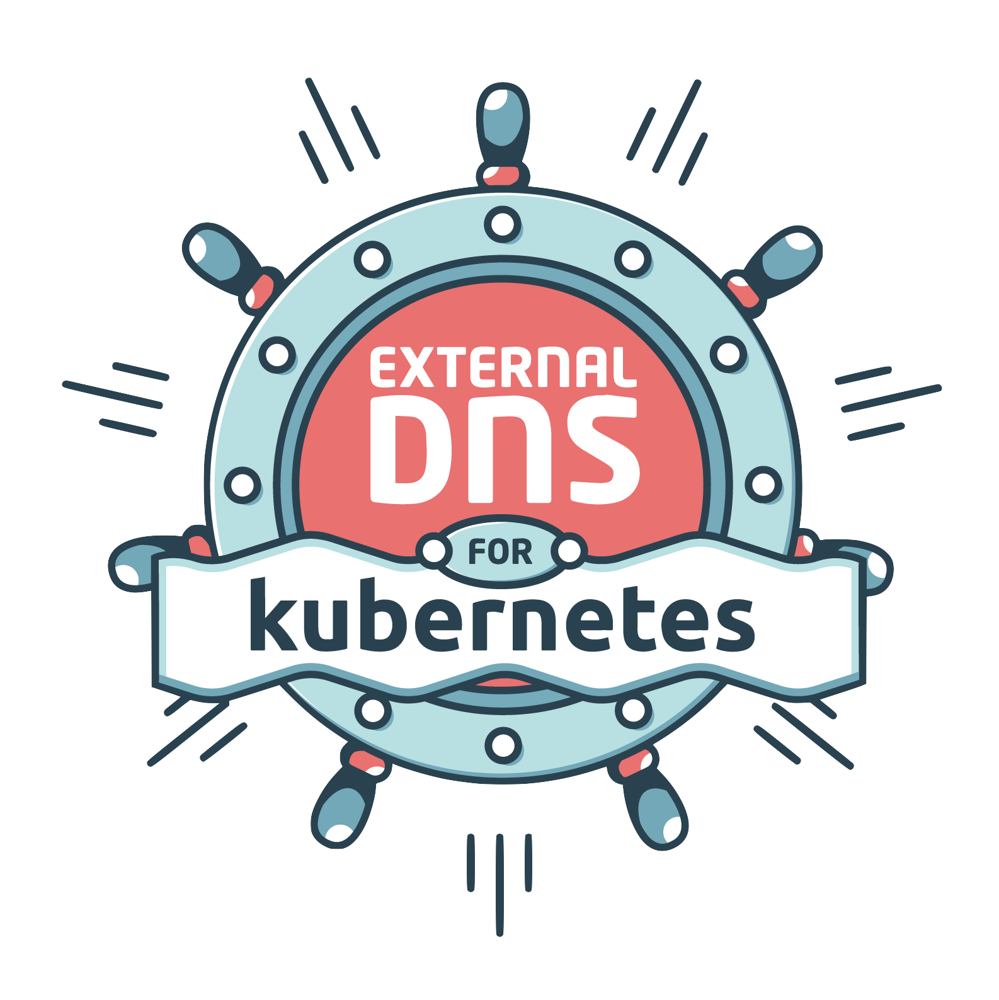

# Supervisor Services

Explore VCF services purpose-built to accelerate modern application delivery and elevate private cloud consumption, with new capabilities continuously added to expand your service portfolio.

## Install Supervisor Services

> 📢 Download links for Service artifacts have moved to [support.broadcom.com](https://support.broadcom.com)

#### Please refer to [How to find and install Supervisor Services](#how-to-find-and-install-supervisor-services) to find and install supervisor services.

Prior to vSphere 8 Update 1, the Supervisor Services are only available with Supervisor Clusters enabled using VMware NSX-T. With vSphere 8 U1, Supervisor Services are also supported when using the vSphere Distributed Switch (VDS) networking stack.

| Supervisor Service | vSphere 7 | vSphere 8 |
| :--: | :--: | :--: |
| vSphere Kubernetes Service | ❌ * | ✅ <br> _requires vSphere 8.0 Update 3 or later_|
| Consumption Interface | ❌ | ✅ <br> _requires vSphere 8.0 Update 3 or later_|
| vSAN Data Persistence Platform Services - MinIO | ✅ | ✅ |
| Backup \& Recovery Service - Velero | ✅ | ✅ |
| Certificate Management Service - cert-manager | ❌ | ✅ |
| Cloud Native Registry Service - Harbor | ❌ * | ✅ |
| Kubernetes Ingress Controller Service - Contour | ❌ | ✅ |
| External DNS Service - ExternalDNS | ❌ | ✅ |
| NSX Management Proxy | ❌ | ✅ <br> _requires vSphere 8.0 Update 3 or later with Supervisor Clusters enabled using VMware NSX-T_  |
| Data Services Manager Consumption Operator | ❌ | ✅ <br> _requires vSphere 8.0 Update 3 or later with additional configuration.<br> Please contact Global Support Services (GSS) for the additional configuration_ |
*\* The embedded Harbor Registry and vSphere Kubernetes Service features are still available and supported on vSphere 7 and onwards.*


## How to find and install Supervisor Services

1. Log in to [support.broadcom.com](https://support.broadcom.com)

2. Select `Enterprise Software` on the left hand side navigation.


3. Select `My Downloads` on the left hand side navigation.

4. Select `Free Software Downloads available HERE`, if you are looking for free services. Search for `vSphere Supervisor Services`.

5. Services that need entitlements can be downloaded directly from `My Downloads`. Search for `vSphere Supervisor Services`.

6. If you are looking to download VMware Private AI Services, go to `My Downloads` and then search for `VMware Private AI Services`.

7. Next navigate to the service of choice and version you are looking to install.

8. To download files, first you need to click `Terms and Conditions` to activate the checkbox.


9. Go through the `Terms and Conditions`. Once you agree, select the checkbox to activate the download icon. 


10. Click on the download icon on the service definition as well as any additional files (such as values.yaml files, etc.)

11. You can now proceed to install your service.

#### Please check [Interoperability Matrix](https://interopmatrix.broadcom.com/Interoperability) to find out which service version is compatible with which Supervisor version.

## Supervisor Services Catalog

  - [vSphere Kubernetes Service (VKS)](#vsphere-kubernetes-service)
    - [vSphere Kubernetes Service (VKS) Versions](#vsphere-kubernetes-service-versions)
  - [Consumption Interface](#consumption-interface)
    - [Consumption Interface Versions](#consumption-interface-versions)
  - [vSAN Data Persistence Platform (vDPP) Services:](#vsan-data-persistence-platform-vdpp-services)
  - [Backup \& Recovery Service](#backup--recovery-service)
    - [Velero vSphere Operator CLI Versions](#velero-vsphere-operator-cli-versions)
    - [Velero Versions](#velero-versions)
  - [Certificate Management Service](#certificate-management-service)
    - [CA Cluster Issuer Versions](#ca-cluster-issuer-versions)
  - [Cloud Native Registry Service](#cloud-native-registry-service)
    - [Harbor Versions](#harbor-versions)
  - [Kubernetes Ingress Controller Service](#kubernetes-ingress-controller-service)
    - [Contour Versions](#contour-versions)
  - [External DNS Service](#external-dns-service)
    - [ExternalDNS Versions](#externaldns-versions)
  - [Supervisor Management Proxy](#supervisor-management-proxy)
    - [Supervisor Management Proxy Versions](#supervisor-management-proxy-versions)
  - [NSX Management Proxy](#nsx-management-proxy)
    - [NSX Management Proxy Versions](#nsx-management-proxy-versions)
  - [Data Services Manager Consumption Operator](#data-services-manager-consumption-operator)
    - [Data Services Manager Consumption Operator Versions](#data-services-manager-consumption-operator-versions)
  - [Secret Store Service](#secret-store-service)
    - [Secret Store Service versions](#secret-store-service-versions)
  - [ArgoCD Service](#argocd-service)
    - [ArgoCD Service versions](#argocd-service-versions)
---
- [Supervisor Services Labs Catalog](#supervisor-services-labs-catalog)
  - [External Secrets Operator](#external-secrets-operator)
    - [External Secrets Operator Versions](#external-secrets-operator-versions)
  - [RabbitMQ Cluster Kubernetes Operator](#rabbitmq-cluster-kubernetes-operator)
    - [RabbitMQ Cluster Kubernetes Operator Versions](#rabbitmq-cluster-kubernetes-operator-versions)
  - [Redis Operator](#redis-operator)
    - [Redis Operator Versions](#redis-operator-versions)
  - [KEDA](#keda)
    - [KEDA Versions](#keda-versions)


## [vSphere Kubernetes Service](https://support.broadcom.com)

#### Please refer to [How to find and install Supervisor Services](#how-to-find-and-install-supervisor-services) to find and install supervisor services.

VMware vSphere Kubernetes Service (VKS, formerly known as the VMware Tanzu Kubernetes Grid Service or TKG Service) lets you deploy Kubernetes workload clusters on the vSphere Supervisor (formerly known as the vSphere IaaS control plane). Starting with vSphere 8.0 Update 3, VKS is installed as a Supervisor Service. This architectural change decouples VKS from Supervisor releases and lets you upgrade VKS independently of vCenter Server and Supervisor.

- Service install [documentation](https://docs.vmware.com/en/VMware-vSphere/8.0/vsphere-iaas-cp-update/GUID-2005FFCD-07F4-450E-BAE5-445BE9D629AE.html)

### vSphere Kubernetes Service Versions

The [Interoperability Matrix](https://interopmatrix.broadcom.com/Interoperability?col=820,18034,18430,18431,18448,18667,18589,18562,19031,19029,19027,19025&row=2,%261794,&isHidePatch=false&isHideLegacyReleases=false) shows each VKS version below, including compatible Kubernetes releases and the vCenter Server versions containing compatible Supervisor versions. Note that some compatible Kubernetes releases may have reached End of Service; refer to the [Product Lifecycle](https://support.broadcom.com/group/ecx/productlifecycle) tool (Division: "VMware Cloud Foundation", Product Name: "vSphere Kubernetes releases") to view End of Service dates for Kubernetes releases.

- VKS v3.4.0
  - [Release Notes](https://techdocs.broadcom.com/us/en/vmware-cis/vcf/vsphere-supervisor-services-and-standalone-components/latest/release-notes/vmware-tanzu-kubernetes-grid-service-release-notes.html#GUID-166807c0-799a-4122-a5de-59c5d158b3e3-en_id-e41377ae-b95a-4df2-8e72-f2424c8af0c3)
- VKS v3.3.3
  - [Release Notes](https://techdocs.broadcom.com/us/en/vmware-cis/vsphere/vsphere-supervisor/8-0/release-notes/vmware-tanzu-kubernetes-grid-service-release-notes.html#GUID-4e548863-c753-46af-b78a-c308d560981d-en_id-516ce6e6-fcaf-4af7-b455-9779386e5f50)
  - [OSS Information](https://packages.broadcom.com/artifactory/vsphere-distro/vsphere/iaas/kubernetes-service/3.3.3-package.open_source_license.txt)
- VKS v3.3.2
  - [Release Notes](https://techdocs.broadcom.com/us/en/vmware-cis/vsphere/vsphere-supervisor/8-0/release-notes/vmware-tanzu-kubernetes-grid-service-release-notes.html#GUID-4e548863-c753-46af-b78a-c308d560981d-en_id-72280637-4785-49e0-8728-860db0f1c284)
  - [OSS Information](https://packages.broadcom.com/artifactory/vsphere-distro/vsphere/iaas/kubernetes-service/3.3.2-package.open_source_license.txt)
- VKS v3.3.1
  - [Release Notes](https://techdocs.broadcom.com/us/en/vmware-cis/vsphere/vsphere-supervisor/8-0/release-notes/vmware-tanzu-kubernetes-grid-service-release-notes.html#GUID-4e548863-c753-46af-b78a-c308d560981d-en_id-d980858e-865c-4182-bc2d-6270521e9a19)
  - [OSS Information](https://packages.broadcom.com/artifactory/vsphere-distro/vsphere/iaas/kubernetes-service/3.3.1-package.open_source_license.txt)
- VKS v3.3.0
  - [Release Notes](https://techdocs.broadcom.com/us/en/vmware-cis/vsphere/vsphere-supervisor/8-0/release-notes/vmware-tanzu-kubernetes-grid-service-release-notes.html#GUID-4e548863-c753-46af-b78a-c308d560981d-en_id-9a8726db-dc10-44f5-8a7c-a030c6366c94)
  - [OSS Information](https://packages.broadcom.com/artifactory/vsphere-distro/vsphere/iaas/kubernetes-service/3.3.0-package.open_source_license.txt)
- VKS v3.2.0
  - [Release Notes](https://techdocs.broadcom.com/us/en/vmware-cis/vsphere/vsphere-supervisor/8-0/release-notes/vmware-tanzu-kubernetes-grid-service-release-notes.html#GUID-4e548863-c753-46af-b78a-c308d560981d-en_id-dc37abc7-0aa5-4d4c-8118-1a041f1afe65)
  - [OSS Information](https://packages.broadcom.com/artifactory/vsphere-distro/vsphere/iaas/kubernetes-service/3.2.0-package.open_source_license.txt)
- VKS v3.1.1
  - [Release Notes](https://techdocs.broadcom.com/us/en/vmware-cis/vsphere/vsphere-supervisor/8-0/release-notes/vmware-tanzu-kubernetes-grid-service-release-notes.html#GUID-4e548863-c753-46af-b78a-c308d560981d-en_id-79e16754-ab76-47cf-a500-9b9ddea90907)
  - [OSS Information](https://packages.broadcom.com/artifactory/vsphere-distro/vsphere/iaas/kubernetes-service/3.1.1-package.open_source_license.txt)
- VKS v3.1.0
  - [Release Notes](https://techdocs.broadcom.com/us/en/vmware-cis/vsphere/vsphere-supervisor/8-0/release-notes/vmware-tanzu-kubernetes-grid-service-release-notes.html#GUID-4e548863-c753-46af-b78a-c308d560981d-en_id-7580485a-27a3-4b85-99b8-412c2d61d6fe)
  - [OSS Information](https://packages.broadcom.com/artifactory/vsphere-distro/vsphere/iaas/kubernetes-service/3.1.0-package.open_source_license.txt)


## [Consumption Interface](https://support.broadcom.com)

#### Please refer to [How to find and install Supervisor Services](#how-to-find-and-install-supervisor-services) to find and install supervisor services.

Provides the Local Consumption Interface (LCI) for Namespaces within vSphere Client.

The minimum required version for using this interface is vSphere 8 Update 3.
```
** IMPORTANT NOTICE **: You must uninstall version 1.0.x before using the 9.0.0 version of LCI. Failure to do so will result in the interface not starting correctly when looking at the Resources tab for a namespace.
```

### Consumption Interface Versions

Installation instructions for installing the supervisor service can be found in the VCF documentation sites.

[Release 9.0](https://techdocs.broadcom.com/us/en/vmware-cis/vcf/vsphere-supervisor-services-and-standalone-components/latest/managing-supervisor-services-with-vsphere-iaas-control-plane/supervisor-service-life-cycle-management-and-consumption/install-a-supervisor-service-on-supervisors.html)

[Release 8.0U3](https://docs.vmware.com/en/VMware-vSphere/8.0/vsphere-with-tanzu-services-workloads/GUID-4843E6C6-747E-43B1-AC55-8F02299CC10E.html)

- Version:
    - 9.0.0 [Release notes](./consumption-interface/Release_Notes_9_0_0.md)
    - v1.0.2 [Release notes](./consumption-interface/Release_Notes_1_0_2.md)

### OSS information

OSS information is available on the Broadcom Customer Portal.

## [vSAN Data Persistence Platform (vDPP) Services](https://support.broadcom.com)

#### Please refer to [How to find and install Supervisor Services](#how-to-find-and-install-supervisor-services) to find and install supervisor services.

vSphere Supervisor offers the vSAN Data Persistence platform. The platform provides a framework that enables third parties to integrate their cloud native service applications with underlying vSphere infrastructure, so that third-party software can run on vSphere Supervisor optimally.

- Using vSAN Data Persistence Platform (vDPP) with vSphere Supervisor [documentation](https://docs.vmware.com/en/VMware-vSphere/7.0/vmware-vsphere-with-tanzu/GUID-F7223607-30A5-4B2D-9B06-A55A65FEAA11.html)
- Enable Stateful Services in vSphere Supervisor [documentation](https://docs.vmware.com/en/VMware-vSphere/7.0/vmware-vsphere-with-tanzu/GUID-F68B264E-76A3-4A6D-A3B0-17153DDF7A18.html)


Available vDPP Services

- MinIO partner [documentation](https://docs.min.io/minio/vsphere/core-concepts/core-concepts.html)
  - Version: 
    - 2.0.10


## [Backup & Recovery Service](https://support.broadcom.com)

#### Please refer to [How to find and install Supervisor Services](#how-to-find-and-install-supervisor-services) to find and install supervisor services.


Velero vSphere Operator helps users install Velero and its vSphere plugin on a vSphere with Kubernetes Supervisor cluster. Velero is an open source tool to safely backup and restore, perform disaster recovery, and migrate Kubernetes cluster resources and persistent volumes.

- Service install [documentation](https://docs.vmware.com/en/VMware-vSphere/7.0/vmware-vsphere-with-tanzu/GUID-DA21BF67-160E-48D9-8D94-0D3690E51FD0.html)

### Velero vSphere Operator CLI Versions

*This is a prerequisite for a cluster admin install.*

- Velero vSphere Operator CLI versions:
    - v1.8.1
    - v1.8.0
    - v1.6.1
    - v1.6.0
    - v1.5.0
    - v1.4.0
    - v1.3.0
    - v1.2.0
    - v1.1.0

### Velero Versions

- Velero vSphere Operator versions: 
    - v1.8.1
    - v1.8.0
    - v1.6.1
    - v1.6.0
    - v1.5.0
    - v1.4.0
    - v1.3.0
    - v1.2.0
    - v1.1.0

## [Certificate Management Service](https://support.broadcom.com)

#### Please refer to [How to find and install Supervisor Services](#how-to-find-and-install-supervisor-services) to find and install supervisor services.


ClusterIssuers are Kubernetes resources that represent certificate authorities (CAs) that are able to generate signed certificates by honoring certificate signing requests. All cert-manager certificates require a referenced issuer that is in a ready condition to attempt to honor the request.

- Service install - Follow steps 1 - 5 in the [documentation](https://docs.vmware.com/en/VMware-vSphere/8.0/vsphere-with-tanzu-services-workloads/GUID-4843E6C6-747E-43B1-AC55-8F02299CC10E.html) then continue to the bullet point below.
- Read [Service Configuration](caclusterissuer/README.md) to understand how to install your root CA into the ca-clusterissuer.

### CA Cluster Issuer Versions

- v0.0.2
- v0.0.1

CA Cluster Issuer Sample `values.yaml`

- We do not provide any default values for this package. Instead, we encourage that you generate certificates. Please read [How-To Deploy a self-signed CA Issuer and Request a Certificate](https://github.com/vsphere-tmm/vsphere-with-tanzu-dev-center/tree/main/cert-manager#how-to-deploy-a-self-signed-ca-issuer-and-request-a-certificate) for information on how to create a self-signed certificate.
)
## [Cloud Native Registry Service](https://support.broadcom.com)

#### Please refer to [How to find and install Supervisor Services](#how-to-find-and-install-supervisor-services) to find and install supervisor services.


Harbor is an open source trusted cloud native registry project that stores, signs, and scans content. Harbor extends the open source Docker Distribution by adding the functionalities usually required by users such as security, identity and management. Having a registry closer to the build and run environment can improve the image transfer efficiency. Harbor supports replication of images between registries, and also offers advanced security features such as user management, access control and activity auditing.

- Since v2.11.2, Harbor supervisor service supports exposing the registry using a load balancer.  Contour is optional, depending on the "enableNginxLoadBalancer" and "enableContourHttpProxy" settings.
- Follow the instructions under [Installing and Configuring Harbor on a Supervisor](https://docs.vmware.com/en/VMware-vSphere/8.0/vsphere-with-tanzu-services-workloads/GUID-8C645717-C473-4E67-8DEE-049B71447B86.html).

### Harbor Versions

- v2.13.1
- v2.12.4
- v2.11.2

Harbor Sample `values.yaml`
  Sample values can be downloaded from the same location as Service yamls.

- Version: values for v2.13.1 - For details about each of the required properties, [see the configuration details page](harbor/README-v2.13.1.md).
- Version: values for v2.12.4 - For details about each of the required properties, [see the configuration details page](harbor/README-v2.12.4.md).
- Version: values for v2.11.2 - For details about each of the required properties, [see the configuration details page](harbor/README-v2.11.2.md).

## [Kubernetes Ingress Controller Service](https://support.broadcom.com)

#### Please refer to [How to find and install Supervisor Services](#how-to-find-and-install-supervisor-services) to find and install supervisor services.


Contour is an Ingress controller for Kubernetes that works by deploying the Envoy proxy as a reverse proxy and load balancer. Contour supports dynamic configuration updates out of the box while maintaining a lightweight profile.

- Service install - Follow steps 1 - 5 in the [documentation](https://docs.vmware.com/en/VMware-vSphere/8.0/vsphere-with-tanzu-services-workloads/GUID-4843E6C6-747E-43B1-AC55-8F02299CC10E.html).

### Contour Versions

- v1.30.3
- v1.29.3
- v1.28.2
- v1.24.4
- v1.18.2

Contour Sample `values.yaml`
- Sample values can be downloaded from the same location as service yaml. These values can be used _as-is_ and require no configuration changes.

## [External DNS Service](https://support.broadcom.com)

#### Please refer to [How to find and install Supervisor Services](#how-to-find-and-install-supervisor-services) to find and install supervisor services.



ExternalDNS publishes DNS records for applications to DNS servers, using a declarative, Kubernetes-native interface. This operator connects to your DNS server (not included here). For a list of supported DNS providers and their corresponding configuration settings, see the [upstream external-dns project](https://github.com/kubernetes-sigs/external-dns).

- On Supervisors where Harbor is deployed with Contour, ExternalDNS may be used to publish a DNS hostname for the Harbor service.

### ExternalDNS Versions

- v0.16.1
- v0.14.2
- v0.13.4
- v0.11.0

ExternalDNS data `values.yaml`

- Because of the large list of supported DNS providers, we do not supply complete sample configuration values here. If you're deploying ExternalDNS with Harbor and Contour, make sure to include `source=contour-httpproxy` in the configuration values. An *incomplete* example of the service configuration is included below. Make sure to setup API access to your DNS server and include authentication details with the service configuration.
- Enabled RFC2136 TLS Connection Configuration from release 0.16.1. Detailed parameters refer to [external-dns/README-0.16.1.md](external-dns/README-0.16.1.md).

```yaml
---
#! use tlsConfig to enable TLS connection with BIND server
#! and require BIND server enables TLS meanwhile
#! if want to keep using nonTLS connection, comment or remove the tlsConfig part
tlsConfig:
  tls_enable: true
  #! User requires to provide base64 encryption format of root ca.crt value 
  #! which uses to validate tls connection with DNS server once tls_enable=true
  ca_crt: "LS0tLS1CRUdJTiBDRVJUSUZJQ0FURS0tLS0tCk1JSUZwekNDQTQrZ0F3SUJBZ0lVZmxLT3I0UkhickVzMG1ucTZKaTE4Y3FqRUQwd0RRWUpLb1pJaHZjTkFRRUwKQlFBd1l6RUxNQWtHQTFVRUJoTUNWVk14RGpBTUJnTlZCQWdNQlZOMFlYUmxNUTB3Q3dZRFZRUUhEQVJEYVhSNQpNUlV3RXdZRFZRUUtEQXhQY21kaGJtbDZZWFJwYjI0eERUQUxCZ05WQkFzTUJGVnVhWFF4RHpBTkJnTlZCQU1NCkJsSnZiM1JEUVRBZUZ3MHlOVEEwTWpnd056UTBNRFZhRncwek5UQTBNall3TnpRME1EVmFNR014Q3pBSkJnTlYKQkFZVEFsVlRNUTR3REFZRFZRUUlEQVZUZEdGMFpURU5NQXNHQTFVRUJ3d0VRMmwwZVRFVk1CTUdBMVVFQ2d3TQpUM0puWVc1cGVtRjBhVzl1TVEwd0N3WURWUVFMREFSVmJtbDBNUTh3RFFZRFZRUUREQVpTYjI5MFEwRXdnZ0lpCk1BMEdDU3FHU0liM0RRRUJBUVVBQTRJQ0R3QXdnZ0lLQW9JQ0FRQzEvY3JmTTF1SGNqdy9HWWpJL3BRcmtTblEKRWZuRTN2byt3R1RTNkxUM0JvdmliTzR6UUpTM2E3STZoaytvdzNYMHlxVklwZUVyVFNtT08wR0xlMUZFTFdHbgpZZHM4UldwZ3dvZUhUN1NlSUVGSnFGMko2bFFKRmFXem5zUlhGdk4rbXlpWk41T2o1Q0w4akViSmo0Wkx3Q0ZOClZQV1dWTDZXSzdpaW9WK2tKRXdFMWp5SHVYbXZVQVlCVk9NZlZsa0ptb01mcy9ZL2RKbXJBb1Z6VlVsc1JzRGEKVTAweUhmdHE2cm83YXFMVXJKaTdjM1FqU3BGTTVTVkVVY0UwUjdQVFhMOGFXcXV5RVI3bWUySjBlMEgvMk5jMwpJVm5ONlNiZURwMS9PdTA3eGxncUZ1UXEzTjNwcXl1VEpSWW9XT0dHd1I2Q3J4L0pkUW4zbU90SFVDMEtwZTJwCi92eTNkVnFHN3ErZ3JwN0pBUFZ2Vkh4dmdYYkJka0RMYmxaMjZQOElxMUp6TTI5ZExRdjFqUnVMNFRmSG5xS0EKZmNKeWU5eWJmeWxkd0dGR2M1VXFPaHB1L1ZOak5lVDNtNHlTSnhCVmZ1Q1phZTBDaWZOMWZ1Nk1TdzJWRU4xbgpOWjdpODBpdTE0ZFAwenFKUnRoSHB6SisxYUx5WGpoSWN3YkZHRkNrODNtSHFadjYzT0owbllKY3ZIL2EvSDRtCm5Gdlcrcmh3TGx6R1JLOWMrWS8rOENNMC9FS3VVd21saWNhZWZwTVE1c1BEak5aVk5TeTMycFJlSmt6TTNvbWsKN21EK1hnT2JpbDZXMnNPb09lYkVzSm15Z0x1RlFJZ0s2NTJHbVoyNkJjc25rWmlKVXJYVFo1N2E5MnZvTlhvQwplUEtKSDZqOWxsTi8wQllrYVFJREFRQUJvMU13VVRBZEJnTlZIUTRFRmdRVXBtdnBBRHVWK0NVYjZ2eUNZeng5CjVLQlQ2ekl3SHdZRFZSMGpCQmd3Rm9BVXBtdnBBRHVWK0NVYjZ2eUNZeng5NUtCVDZ6SXdEd1lEVlIwVEFRSC8KQkFVd0F3RUIvekFOQmdrcWhraUc5dzBCQVFzRkFBT0NBZ0VBSThYTk8yQ0xvNWRDc1V6MEZEVTlZUkduT2Z1NApxWGVWOEg4K1czc290L2hBNk5BdGtvcUZqUUpWVmt5QVI4R3NtdnkxUFRRQlVxRTAvbE1DeWdNbGxwMVlwZnhNCmhwSUNWalp4bVZwQjBiTmpMMnJ5WWlrTGdjQVEzYTd5aWphTUFvaUlyREdxYVNodVVoMFFOWmVLUWxMdEJ3OTMKdFR3dGlQMjRFU0s3a05TOXR3blgwYWU0UTJLK09rdzZVQkVyd1h0TnZrKzBGUDAxcVJ4MXFsQ01CeCtqTHFiTgpwZ21PYjFxNFFQSGt4NzEvai9Gdm8xTUdRZm5McEJXakdaMmIvMW5FWEVvMHhVL3llYnpTYTBZT3Y3ZGptcjNqCkp5bHg2RkQySEpCS1ZsT0tBek1rNmlyaUpVeExDUnNSZlI1NEU3NG1TY0NVVXp1OS9UTTYwN2NFNmw4ZVB1VEEKL2FOMFlLeDV3ZEJkSkVadkxyUzVORTZpUjJ6WnVHamJTZFRWLzJFb3Zlc0pPQ1FkUGhYTm12T3lWK280TTRieQpKZ0U2WWxKWldnekVHa0Y2TWQvN3RmaG1BMDMxUUc4NnZqdVJVMWhWSC8vRmF2K3lac0NBRnBBYlNua004czdUCjNQQkxDOWFOSkFOOVVySTRnWGg2aWJFUGRMTnYwdE1hR0JwWDBVMFdub1R0WnlaMGJhVVlSUW90Ly94MGgvQU0KdnRFZlNtYlh0ZlZKZERqZHByTER0emxZWXhOTjVUWHdOTEpNYWJFekowVUV5ZE1NZGJocFN4cXJ4elFNWkhvSwpibFlzWS9hNFJVQXI4NVVjdC8xcjFlR0I0U2dUcVk0aTNMd1p6N2I3SHRZaUZQdmZ0SW5XWnJUbk0rQ2NwTmwzCnV5WUxhQThkd25QQWR1OD0KLS0tLS1FTkQgQ0VSVElGSUNBVEUtLS0tLQo="
  
deployment:
  args:
  - --source=contour-httpproxy
  - --source=service
  - --log-level=debug
```

Validated Supported DNS Server Example:
- RFC2136 BIND DNS Server: Sample values can be downloaded from the same location as service.yaml. Replace the values indicated by the comments with your own DNS server details.

## [Supervisor Management Proxy](https://support.broadcom.com)

#### Please refer to [How to find and install Supervisor Services](#how-to-find-and-install-supervisor-services) to find and install supervisor services.

Supervisor Management Proxy is required when there is isolation between management network and workload network and the VKS clusters in workload network cannot reach components running in management network.

Supervisor Management Proxy supports following usecases:
- Antrea-NSX adapter in VKS cluster to reach NSX manager. (Same as NSX Management Proxy)
- Send metrics from VKS Clusters to VCF Ops when monitoring VKS Clusters in VCF Ops.

### Supervisor Management Proxy Versions
  
- v0.3.0 (requires vSphere 9.0 or later)

Supervisor Management Proxy Sample `values.yaml`
- Download sample values.yaml from the same location as Service yaml.
- For Antrea-NSX usecase, make sure to fill the property `nsxManagers` with your NSX Manager IP(s).
- For VKS monitoring usecase, no need to fill any property in data values to configure the Supervisor Management Proxy.

## [NSX Management Proxy](https://support.broadcom.com)

#### Please refer to [How to find and install Supervisor Services](#how-to-find-and-install-supervisor-services) to find and install supervisor services.

NSX Management Proxy is for Antrea-NSX adapter in Kubernetes clusters deployed by VKS to reach NSX manager. NSX Management Proxy is used when there is isolation between management network and workload network and the VKS clusters cannot reach NSX manager.

We recommend to use Supervisor Management Proxy over NSX Management Proxy. The two proxies cannot be used together. If you are already using NSX Management Proxy, consider migrating to Supervisor Management Proxy for additional usecases. Contact Broadcom support for migration steps.

NSX Management Proxy is deprecated since vSphere 9.0. We still maintain it for vSphere 8.0.* - 9.0.*, but will not maintain it for future vSphere releases.

### NSX Management Proxy Versions
- For vSphere 8.0 Update 3 or later
  - v0.2.2
- For vSphere 8.0 Update 3
  - v0.2.1
  - v0.2.0
  - v0.1.1

NSX Management Proxy Sample `values.yaml`
- Download sample values.yaml from the same location as Service yaml. Make sure to fill the property `nsxManagers` with your NSX Manager IP(s).

**Note:** NSX Management Proxy is supported in vSphere 8.0 Update 3 when Supervisor Clusters are enabled using VMware NSX-T networking stack under following configurations:
- NSX Load Balancer is configured as load balancing solution.
- NSX Gateway Firewall is enabled.

## [Data Services Manager Consumption Operator](https://support.broadcom.com)

#### Please refer to [How to find and install Supervisor Services](#how-to-find-and-install-supervisor-services) to find and install supervisor services.

The Data Services Manager(DSM) Consumption Operator facilitates native, self-service access to DSM within a Kubernetes environment. It exposes a selection of resources supported by the DSM provider, allowing customers to connect to the DSM provider from Kubernetes. Although the DSM provider does not currently support tenancy natively, the DSM Consumption Operator enables customers to seamlessly integrate their existing tenancy model, effectively introducing tenancy into the DSM provider.

- The DSM provider is a prerequisite for DSM consumption operator, so that must be installed first.
- Installation instructions can be found [here in VMware documentation](https://docs.vmware.com/en/VMware-vSphere/8.0/vsphere-with-tanzu-services-workloads/GUID-A0A5F6D4-87A4-46CA-A50A-33664F43F299.html)
- Configuration instructions can be found [here in VMware documentation](https://docs.vmware.com/en/VMware-vSphere/8.0/vsphere-with-tanzu-services-workloads/GUID-4843E6C6-747E-43B1-AC55-8F02299CC10E.html).

### Data Services Manager Consumption Operator Versions

- v9.0.0.0
- v2.2.1
- v2.2.0
- v1.2.0
- v1.1.2
- v1.1.1
- v1.1.0

Data Services Manager Consumption Operator Sample values. yaml
- Sample values can be found at the same location as service yaml

- v9.0.0.0: For details about each of the required properties, [see the configuration details page](dsm-co/README_9_0_0_0.md#data-services-manager-consumption-operator-9.0.0.0-configuration).
- v2.2.1 For details about each of the required properties, [see the configuration details page](dsm-co/README_2_2_1.md#data-services-manager-consumption-operator-2.2.1-configuration).
- v2.2.0 For details about each of the required properties, [see the configuration details page](dsm-co/README_2_2_0.md#data-services-manager-consumption-operator-2.2.0-configuration).
- v1.2.0 For details about each of the required properties, [see the configuration details page](dsm-co/README_1_2_0.md#data-services-manager-consumption-operator-1.2.0-configuration).

**Installation Note:**

- DSM Consumption Operator v9.0.0.0<br>
  You should add a new field isSupervisor in dsm section of the values yaml and its value should always be bool true. If you encounter any issues related to the Service-id, please contact Global Support Services (GSS) for immediate assistance.
- DSM Consumption Operator v2.2.X<br>
  When installing DSM Consumption Operator v2.2.X as a Supervisor Service, if you encounter any issues related to the Service-id, please contact Global Support Services (GSS) for immediate assistance.

**Upgrade Note:**

- DSM Consumption Operator v9.0.0.0<br>
  If you are upgrading from v2.2.X to 9.0.0.0, do not uninstall the existing version and do not change the values yaml. Instead, we highly recommend contacting GSS for guidance and support. This will ensure a smooth upgrade process and prevent potential disruptions.
  For additional help, please refer to the support documentation or reach out to our technical support team.
- DSM Consumption Operator v2.2.X<br>
  Earlier versions of the DSM Consumption Operator, including v1.1.0, v1.1.1, v1.1.2 and v1.2.0 are deprecated and should not be used for new Supervisor Service installation.
  If you are upgrading from these older versions to v2.2.X, do not uninstall the existing version. Instead, we highly recommend contacting GSS for guidance and support. This will ensure a smooth upgrade process and prevent potential disruptions.
  For additional help, please refer to the support documentation or reach out to our technical support team.

## [Secret Store Service](https://support.broadcom.com)

#### Please refer to [How to find and install Supervisor Services](#how-to-find-and-install-supervisor-services) to find and install supervisor services.


Secret Store Service is a comprehensive solution for managing secrets in vSphere, ensuring the security and integrity of the environment and providing a robust and scalable solution for securely injecting secrets into workloads.

### Secret Store Service Versions 

- v9.0.0

Secret Store Service sample `values.yaml`
- Sample values can be downloaded from the same location as service yaml. Make sure to fill the property `storageClassName` with storage policy name.

## [ArgoCD Service](https://support.broadcom.com)

#### Please refer to [How to find and install Supervisor Services](#how-to-find-and-install-supervisor-services) to find and install supervisor services.


Argo CD empowers teams to deliver applications with speed and precision by continuously synchronizing Git-defined desired state with live environments.Argo CD, a leading declarative GitOps continuous delivery tool, revolutionizes how teams deploy and manage applications. It champions a paradigm where the desired state of applications and infrastructure is explicitly defined in Git repositories. This "Git-defined desired state" serves as the single source of truth, offering unparalleled transparency, version control, and auditability for deployments.
ArgoCD Service provides the entire lifecycle of Argo CD instance, including create, delete, upgrade ArgoCD and update its configurations. It gives both platform teams and developers access to automated, version-controlled delivery pipelines—whether they’re managing vSphere Kubernetes Service (VKS) clusters, VMs, vSphere Pods on supervisor cluster or workloads on VKS clusters.
- Service installation and Configuration [documentation](https://techdocs.broadcom.com/us/en/vmware-cis/vcf/vsphere-supervisor-services-and-standalone-components/latest/using-supervisor-services/using-argo-cd-service.html)

### ArgoCD Service Versions
- v1.0.0
  - [Release Notes](argocd-service/release-notes-v1.0.0.md) 
- v1.0.1
  - [Release Notes](argocd-service/release-notes-v1.0.1.md) 

---

# Supervisor Services Labs Catalog

## *Experimental*

The following Supervisor Services Labs catalog is only provided for testing and educational purposes. Please do not use these services in a production environment. These services are intended to demonstrate Supervisor Services' capabilities and usability. VMware will strive to provide regular updates to these services. The Labs services have been tested starting from vSphere 8.0. Over time, depending on usage and customer needs, some of these services may be included in the core product.

**WARNING** - By downloading and using these solutions from the Supervisor Services Labs catalog, you explicitly agree to the conditional use **[license agreement](supervisor-services-labs/licence-agreement.md)**.

## External Secrets Operator


External Secrets Operator is a Kubernetes operator that integrates external secret management systems like AWS Secrets Manager, HashiCorp Vault, Google Secrets Manager, Azure Key Vault, IBM Cloud Secrets Manager, CyberArk Conjur, etc. The operator reads information from external APIs and automatically injects the values into a Kubernetes Secret. For a detailed description of how to consume External Secrets Operator, visit [External Secrets Operator project](https://external-secrets.io/latest/)

### External Secrets Operator Versions

- Download latest version: [External Secrets Operator v0.9.14](supervisor-services-labs/external-secrets-operator/v0.9.14/external-secrets-operator.yaml)

External Secrets Operator Sample `values.yaml` - None

- We do not provide this package's default `values.yaml`. This operator requires minimal configurations, and the necessary pods get deployed in the `svc-external-secrets-operator-domain-xxx` namespace.

#### Usage:

- Check out this example on how to access a secret from **GCP Secret Manager** using External Secrets Operator [here](supervisor-services-labs/external-secrets-operator/usage.md)

## RabbitMQ Cluster Kubernetes Operator


The RabbitMQ Cluster Kubernetes Operator provides a consistent and easy way to deploy RabbitMQ clusters to Kubernetes and run them, including "day two" (continuous) operations. RabbitMQ clusters deployed using the Operator can be used by applications running on or outside Kubernetes. For a detailed description of how to consume the RabbitMQ Cluster Kubernetes Operator, see the [RabbitMQ Cluster Kubernetes Operator project.](https://www.rabbitmq.com/kubernetes/operator/operator-overview)

### RabbitMQ Cluster Kubernetes Operator Versions

- Download latest version: [RabbitMQ Cluster Kubernetes Operator v2.8.0](supervisor-services-labs/rabbitmq-operator/v2.8.0/rabbitmq-operator.yaml)

RabbitMQ Cluster Kubernetes Operator Sample `values.yaml` -

- Modify the latest [values.yaml](supervisor-services-labs/rabbitmq-operator/v2.8.0/values.yaml) by providing a new location for the RabbitMQ Cluster Kubernetes Operator image. This may be required to overcome DockerHub's rate-limiting issues. The RabbitMQ Cluster Kubernetes Operator pods and related artifacts get deployed in the `svc-rabbitmq-operator-domain-xx` namespace.

#### Usage:

- Check out this example on how to deploy a RabbitMQ cluster using the RabbitMQ Cluster Kubernetes Operator [here](supervisor-services-labs/rabbitmq-operator/usage.md)
- For advanced configurations, check the [detailed reference](https://www.rabbitmq.com/kubernetes/operator/operator-overview).

## Redis Operator


A Golang-based Redis operator that oversees Redis standalone/cluster/replication/sentinel mode setup on top of Kubernetes. It can create a Redis cluster setup using best practices. It also provides an in-built monitoring capability using Redis-exporter. For a detailed description of how to consume the Redis Operator, see the [Redis Operator project.](https://ot-redis-operator.netlify.app/docs/overview/)

### Redis Operator Versions

- Download latest version: [Redis Operator v0.16.0](supervisor-services-labs/redis-operator/v0.16.0/redis-operator.yaml)

Redis Operator Sample `values.yaml` -

- We do not provide this package's default `values.yaml`. This operator requires minimal configurations, and the necessary pods get deployed in the `svc-redis-operator-domain-xxx` namespace.

#### Usage:

- View an example of how to use the Redis Operator to deploy a Redis standalone instance [here](supervisor-services-labs/redis-operator/redis-instance.yaml)
- For advanced configurations, check the [detailed reference](https://ot-redis-operator.netlify.app/docs/getting-started/).

## KEDA


KEDA is a single-purpose and lightweight component that can be added into any Kubernetes cluster. KEDA works alongside standard Kubernetes components like the Horizontal Pod Autoscaler and can extend functionality without overwriting or duplication. With KEDA you can explicitly map the apps you want to use event-driven scale, with other apps continuing to function. This makes KEDA a flexible and safe option to run alongside any number of any other Kubernetes applications or frameworks. For a detailed description of how to use KEDA, see the [Keda project.](https://keda.sh/)

### KEDA Versions

- Download latest version: [KEDA v2.13.1](supervisor-services-labs/keda/v2.13.1/keda.yaml) Note: This version supports Kubernetes v1.27 - v1.29.

KEDA Sample `values.yaml` -

- We do not provide this package's default `values.yaml`. This operator requires minimal configurations, and the necessary pods get deployed in the `svc-kedaxxx` namespace.

#### Usage:

- View an example of how to use KEDA `ScaledObject` to scale an NGINX deployment [here](supervisor-services-labs/keda/usage.md).
- For additonal examples, check the [detailed reference](https://github.com/kedacore/samples).

